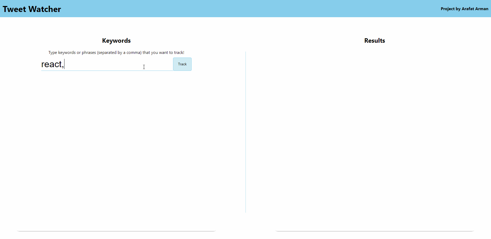

# Tweet Watcher

A React web-application that utilizes `node-tweet-stream` and `socket.io` to display a real-time feed of Tweets that contain user-inputted keywords!



## How to run

### Setup:

<strong>In order to use Twitter's API services, you must obtain authorization keys.</strong> <br/>
This is done by creating a <a href="https://developer.twitter.com/en/apply-for-access">Twitter Developer Account</a>.

You must have installed the following npm packages:

- `npm install socket.io` // socket.io server
- `npm install socket.io-client` // socket.io client
- `npm install node-tweet-stream` // allows us to utilize Twitter's real-time filtered stream
- `npm install dotenv` // allows us to use environment variables

### Procedure:

- While in `tweet-watcher/backend/`, run `touch .env`
- Edit `.env` as such:

```
API_KEY=YOUR_API_KEY_GOES_HERE
API_SECRET=YOUR_API_SECRET_GOES_HERE
BEARER=YOUR_BEARER_TOKEN_GOES_HERE
TOKEN=YOUR_APPLICATION_TOKEN_GOES_HERE
TOKEN_SECRET=YOUR_APPLICATION_SECRET_GOES_HERE
```

- Save `.env`
- While in `tweet-watcher/backend/`, run `npm start` -- this runs the node server (localhost:9000)
- While in `tweet-watcher/frontend/`, run `npm start` -- this runs the React web application (localhost:3000)

You should now be able to access the web application at localhost:3000.

Have fun!

## How to help out

This web application isn't perfect! I'm sure you can find many bugs or unintuitive features. Feel free to create issues! <br/>
It will help us become better software developers!
